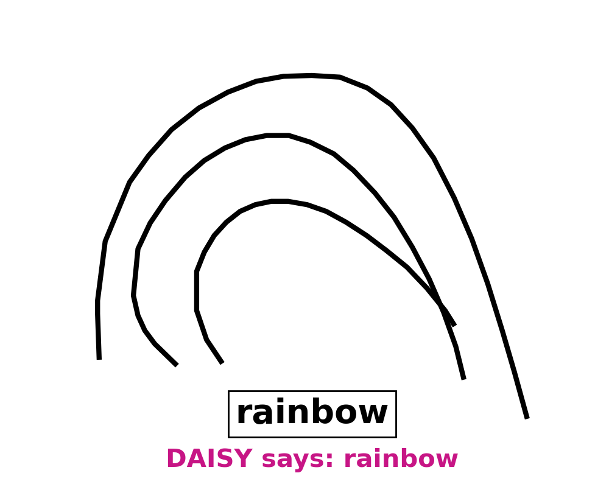
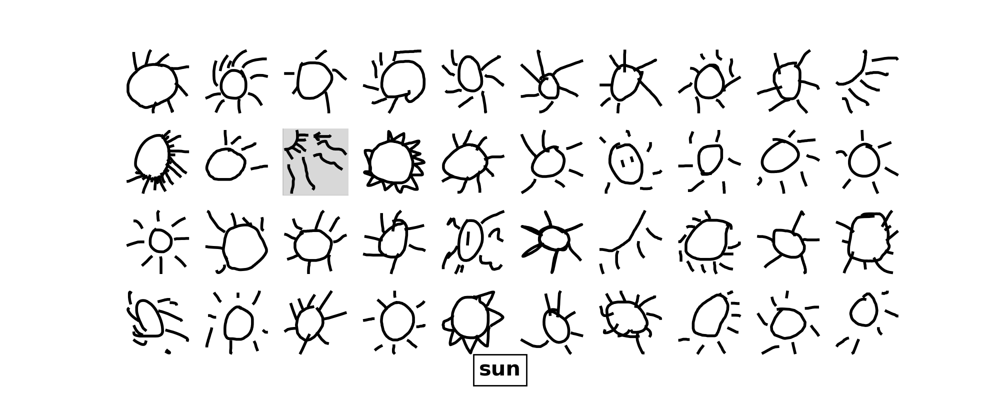
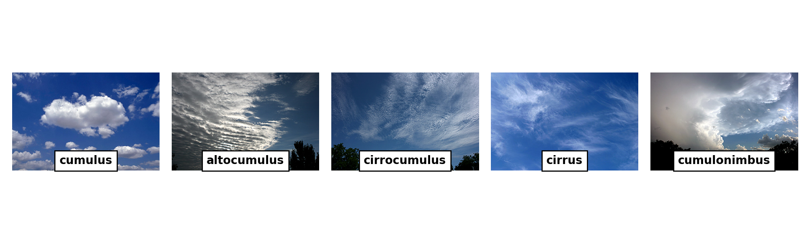

# Artist vs The Machine: Can you beat an AI at Pictionary?

[](https://mybinder.org/v2/gh/kirana-bergstrom/artist-vs-machine/HEAD?labpath=notebook_tutorial.ipynb)
[](https://colab.research.google.com/github/kirana-bergstrom/artist-vs-machine/blob/trunk/colab_notebook_tutorial.ipynb)

Click the Binder badge to run the interactive tutorial in Binder, or the colab badge to run in Google Colab. **NOTE: currently the Colab link is the only version that is working! Binder will be updated soon.**

This repository contains materials needed to run an interactive tutorial on utilizing Artificial Intelligence (AI) for atmospheric science titled "Artist vs. The Machine: can you beat an AI at Pictionary?".
The tutorial demonstrates the usefulness of image classification for scientific applications by creating and demoing a model - named DAISY - that can identify simply sketches of weather patterns, then walks students through some guided discussion questions that make the connection between sketch classification (i.e. Pictionary) and real-world applications in meteorology.

This tutorial is aimed at middle to high school level students, and contains an interactive component where students create their own sketches online and the instructor inputs these sketches into the AI and shows the results in real-time.
It uses Google's [Quick Draw!](https://quickdraw.withgoogle.com) Dataset for training the AI model and was originally developed by scientists at the Global Systems Laboratory of the National Oceanic at Atmospheric Administration (NOAA) and the Cooperative Institute for Research in Earth Sciences (CIRES) at the University of Colorado Boulder.
It also directs students to [Sketchpad](https://sketch.io/sketchpad/) to draw their own sketches. 

The repository contains all of the code necessary for downloading the Quick Draw data, preprocessing the Quick Draw data, preprocessing student sketches, building and running the model, running some basic diagnostics, and displaying the sketches in various forms.
It also contains a Jupyter Notebook that can be run during the tutorial, which utilizes a variety of interactive widgets to display the data and demonstrate AI techniques.


The current materials are designed for meteorology-focused applications and focus on identification of weather patterns or phenomena.

Although untested, the tutorial could be easily modified for other scientific applications by modifying the appropriate content in the accompanying presentation, and modifying the [categories](categories.txt) we pull the training data from.
For example, an oceanic science application might use drawings from the canoe, cruise ship, dolphin, sailboat, shark, and whale categories, and discuss satellite image identification of types of sea creatures vs. boats and commercial vs. leisure boats, etc.
A biology application might use drawings from the tiger, lion, dog, crocodile, frog and hedgehog categories, and discuss automatic identification of species from trail cameras.

Please note that the raw data set is pulled directly from Google and while it was individually moderated, it may still contain inappropriate content.
Any images that are created with the weather categories and using all the pre-set random seeds, numbers of samples, and indices in this version of the code, have been checked for inappropriate content.
Before giving this tutorial, it is advised that you check all the generated images in the slides and tutorial notebook.


## Content
- [Getting started](#getting-started)
- [Pulling the raw data](#pulling-the-raw-data)
- [Running the code](#running-the-code)
- [Tutorial notebook and slides](#tutorial-notebook-and-slides)
- [Instructor tutorial guide](#instructor-tutorial-guide)
- [Contributing](#contributing)

## Getting started
A straightforward way to teach the material in this tutorial is to use the hosted notebook available on Binder.
Click the Binder badge at the top of this README.

Otherwise, you can run the tutorial on your local machine using the instructions below.

Pull the repo and navigate to it using
```sh
$ git pull https://github.com/artist-vs-the-machine
$ cd artist-vs-the-machine
```
Create and activate a conda environment with the necessary requirements using the commands
```sh
$ conda create artist_v_machine
```

In the top level of the repository, the most important file is the "categories.txt" file.
It can be modified to include a different subset of categories from the Quick, Draw! dataset categories as desired.

[OPTIONAL] After setting up the environment, modify [categories.txt](categories.txt) as needed and run
```sh
$ ./setup.sh
```
to (optionally) download the raw data and create the necessary directory structure.
Downloading the raw data takes some time, and should be done before actually running the tutorial if desired.
A subset of preprocessed data is in the Github repository, so downloading the data can be skipped if the categories are the same as in the already set up tutorial.

## Running the code
Two steps of this tutorial, preprocessing the data and training the model, take a significant amount of time.
It is recommended to do both before running the tutorial, or to simply use the provided, pretrained model and preprocessed data.
Each way of running the code gives the option to preprocess and train or not, with the default set to not for both.

### Tutorial notebook and slides
It is recommended to run the tutorial using the included Jupyter Notebook [notebook_tutorial.ipynb](notebook_tutorial.ipynb)

You can run the notebook using the command
```sh
$ jupyter notebook ./tutorial/notebook_tutorial.ipynb
```

Options for preprocessing and running the data are in code cells at the top of the notebook.

### Running the code
You can also run the code from the command line using the code contained in [run.py](run.py) using the commands
```sh
$ python run.py no_preprocess no_train
```

The options can be changed to preprocess and build to preprocess the data and train the model, respectively.

## Instructor tutorial guide
A PDF is included in this repository for instructors to use here.

## Contributing
Contributions are welcome.
Bug fixes and code improvements can be submitted via pull request.
To add additional content including modified presentations for other applications, please email [kirana.bergstrom@noaa.gov](mailto:kirana.bergstrom@noaa.gov) before submitting a pull request.
